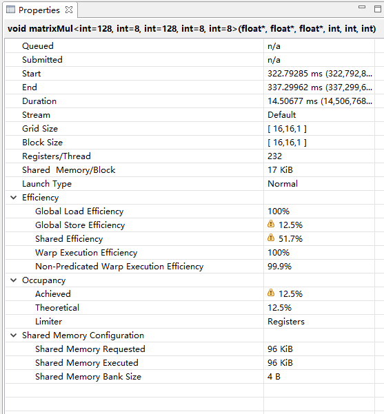

### 编译

```
-L 库目录
-l 库名称
nvcc matrixMul_v6.cu -o v6 -L "C:/Program Files/NVIDIA GPU Computing Toolkit/CUDA/v11.1/lib/x64/" -lcublas

# 运行
v1.exe 2048 2048 2048
Time: 91.462212 ms
Performance (GFlop/s): 187.84

v2 128x8 tile A 8x128 tile B 的数据加载到共享内存，每个线程处理 8x8 的数据量
Time: 14.797824 ms
Performance (GFlop/s): 1160.97

v3 从全局内存加载到共享内存进行 Prefetching
Time: 15.162720 ms
Performance (GFlop/s): 1133.03

v4 从全局内存加载到共享内存进行 Prefetching，同时计算之前也进行数据 Prefetching，把要计算的数据加载到 寄存器中
Time: 14.476288 ms
Performance (GFlop/s): 1186.76


------ V6 ------
Time: 5.595904 ms
Performance (GFlop/s): 3070.08
------ cublas ------
Time: 5.184512 ms
Performance (GFlop/s): 3313.69
ratio:0.93
```

## 最终优化到 `cublas` 的 93% 的性能

`v6` 参考 `https://github.com/Yinghan-Li/YHs_Sample` 和 `https://github.com/Liu-xiandong/How_to_optimize_in_GPU`

比较可惜的是这两份代码有一份没正确运行，另一份结果错误，不知道什么原因。

最后，按照 `YHs_Sample` 代码的注释实现

```
 * ----------------------------------------------------------------
 * thread block tile map:
 *
 *                                128
 *                    --|---------------------|
 *             B_tile  8|                     |
 *                    --|---------------------|
 *
 *  A_tile   | 8 |      |    64    |
 *         --|---|    --|----------|----------|
 *           |   |    32|  warp_0  |  warp_1  |
 *           |   |    --|----------|----------|
 *           |   |      |  warp_2  |  warp_3  |
 *        128|   |      |----------|----------|
 *           |   |      |  warp_4  |  warp_5  |
 *           |   |      |----------|----------|
 *           |   |      |  warp_6  |  warp_7  |
 *         --|---|      |----------|----------|
 *
 * ----------------------------------------------------------------
 * warp tile map:
 *
 * 'z' thread map to avoid LDS.128 shared memory broadcast limitation.
 *
 *              |              32               ||
 *     B_frag --|---|---|---|---|---|---|---|---||---|---|---|---|---|---|---|---|
 *             1|///|   |   |   |   |   |   |   ||///|   |   |   |   |   |   |   |
 *            --|---|---|---|---|---|---|---|---||---|---|---|---|---|---|---|---|
 * A_frag       | 4 |                           ||
 *    | 1 |                                     ||
 *  --|---|--   |---|---|---|---|---|---|---|---||---|---------------------------|
 *    |///|4    |t0 |t2 |t4 |t6 |t8 |t10|t12|t14||t0 |                           |
 *    |---|--   |---|---|---|---|---|---|---|---||---|                           |
 *    |   |     |t1 |t3 |t5 |t7 |t9 |t11|t13|t15||                               |
 *  16|---|     |---|---|---|---|---|---|---|---||                               |
 *    |   |     |t16|t18|t20|t22|t24|t26|t28|t30||                               |
 *    |---|     |---|---|---|---|---|---|---|---||                               |
 *    |   |     |t17|t19|t21|t23|t25|t27|t29|t31||                               |
 *  ==|===|=====|===|===|===|===|===|===|===|===||===|============================
 *    |///|     |t0 |                           ||t0 |                           |
 *    |---|     |---|                           ||---|                           |
 *    |   |     |                               ||                               |
 *    |---|     |                               ||                               |
 *    |   |     |                               ||                               |
 *    |---|     |                               ||                               |
 *    |   |     |                               ||                               |
 *    |---|     |-------------------------------||-------------------------------|
```

`v4` 和 `v6` 对比图

|
---|---
