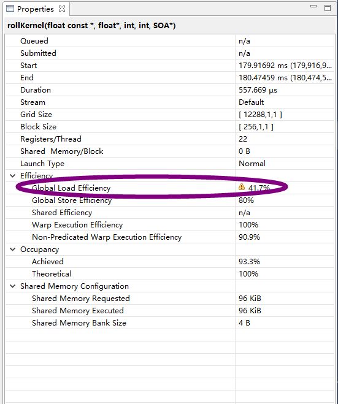
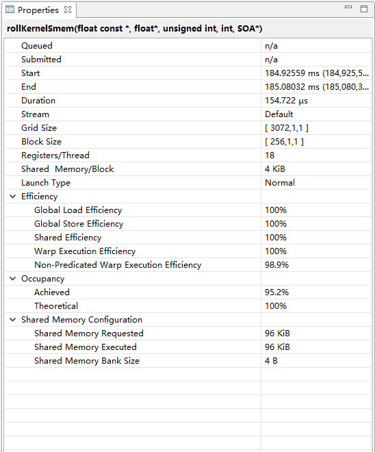

## 优化 `torch.roll` `cuda` 实现

性能提升 **3.5** 倍


### 需要解决的几个问题

1. `roll` 的参数传递

`roll` 算子有几个参数，`shifts` 和 `dims` 还有额外参数，太零碎，传给 `GPU` 写起来太麻烦，**`SOA`** 是比较好的处理方式，一个一次搞定

2. 对于 3/4 个维度矩阵，$N\times H\times W$，如何分配核函数的 `Block` 和 `Grid`

`roll` 算子作用于 `H` 、`W` 维度，一个 256 的线程块处理一行 `W` 个数据，那 `Grid` 就是 $N*H$


- `roll.cu` 实现 `roll` 的正确版本，对于输入矩阵 $3\times 4\times 5$，可以打印验证正确性，作为 `baseline`


`roll_v1.cu` 评估性能 | `roll_v2.cu` 优化 | 
---|---
Time: 0.560768 ms |  Time: 0.160544 ms |
Bandwidth (GB/s): 44.877424 |Bandwidth (GB/s): 156.753440  


使用 `nvvp` 查看


 | 
---|---


```
nvprof --metrics gld_efficiency,gst_efficiency v2.exe 


Invocations                               Metric Name                        Metric Description         Min         Max         Avg
Device "GeForce GTX 1060 6GB (0)"
    Kernel: rollKernel(float const *, float*, int, int, SOA*)
          1                            gld_efficiency             Global Memory Load Efficiency      41.67%      41.67%      41.67%
          1                            gst_efficiency            Global Memory Store Efficiency      80.00%      80.00%      80.00%
    Kernel: rollKernelSmem(float const *, float*, unsigned int, int, SOA*)
          1                            gld_efficiency             Global Memory Load Efficiency      82.50%      82.50%      82.50%
          1                            gst_efficiency            Global Memory Store Efficiency     100.00%     100.00%     100.00%
```

### 诡异

对比 核函数 `rollKernelSmem` `nvprof gld_efficiency` 和 `nvvp Global Load Efficiency`，**结果竟然不一样**

而核函数 `rollKernel`  `nvprof gld_efficiency` 和 `nvvp Global Load Efficiency`，**结果确是一样的**


