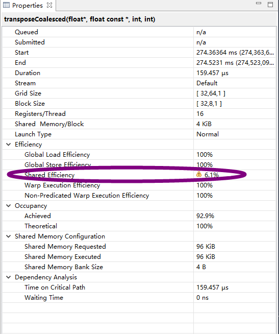
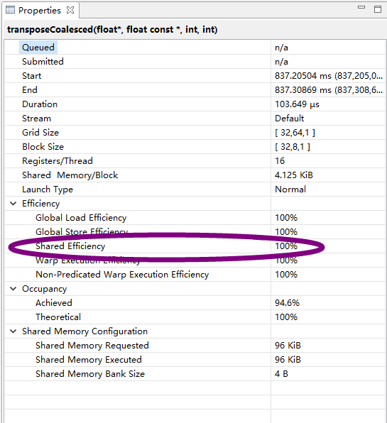

<p hidden>
1. 输入矩阵在线程块中能用按列访问？
<p hidden>
对于输入矩阵 `a[2048][2048]`，表面上线程块中，线程 id 都是 `ix: 0 1 2 3`，`iy: 0 1 2 3`，
无论 `iy*nx + ix` 还是 `ix*ny + iy`, 取值都没区别。但是，线程块中，连续的线程是先 x 再 y 递增

</p>

用 <<cuda 编程权威指南>> 的代码对于 $ny\times nx=2048\times 1024$ 不能获得正确结果，所以用 $ny\times nx=2048\times 1024$ 测试正确性和性能

输入矩阵 $ny\times nx=2048\times 1024$，`transposeRow` 的逻辑是 ` out[ix][iy] = in[iy][ix]`，`transposeCol` 的逻辑是 `out[iy][ix] = in[ix][iy]`

因为线程块内的线程是，先 `x` 再 `y`增加序号，所以 `in[ix * nx + iy]` 能实现按列加载数据

### transpose_v1


> <<cuda 编程权威指南>>
>
> 通过缓存交叉读取能够获得更高的加载吞吐量。

```
transposeRow # 按行加载数据/按列存储
Time: 0.321056 ms
Bandwidth (GB/s): 52.256352

nvprof --metrics gld_throughput,gst_throughput v1.exe
Invocations                               Metric Name                        Metric Description         Min         Max         Avg
Device "GeForce GTX 1060 6GB (0)"
    Kernel: transposeRow(float*, float*, int, int)
          1                            gld_throughput                    Global Load Throughput  24.568GB/s  24.568GB/s  24.568GB/s
          1                            gst_throughput                   Global Store Throughput  196.54GB/s  196.54GB/s  196.54GB/s


transposeCol # 按列加载数据/按行存储，
Time: 0.161760 ms
Bandwidth (GB/s): 103.716712

nvprof --metrics gld_throughput,gst_throughput v1.exe
Invocations                               Metric Name                        Metric Description         Min         Max         Avg
Device "GeForce GTX 1060 6GB (0)"
    Kernel: transposeCol(float*, float*, int, int)
          1                            gld_throughput                    Global Load Throughput  192.52GB/s  192.52GB/s  192.52GB/s
          1                            gst_throughput                   Global Store Throughput  48.129GB/s  48.129GB/s  48.129GB/s

```

### transpose_v2

分块展开，效果并没有变好，因为并不像 `reduce` 中存在很多计算操作能够达到延迟隐藏的效果，合并读取在线程束中的效果由于 $16\times 16$ 的线程块也并没有体现出来。

**直到使用了 8块展开效果才好起来**
```
transposeUnroll4Col
Time: 0.165248 ms
Bandwidth (GB/s): 101.527496

# 一个线程每列加载 8个数据，展开才有效果
Time: 0.161696 ms
Bandwidth (GB/s): 103.757768
```

### transpose_v3

```
Time: 0.155776 ms
Bandwidth (GB/s): 107.700904

# 全局内存事务请求
nvprof --metrics gld_transactions_per_request,gst_transactions_per_request v3.exe

Invocations                               Metric Name                        Metric Description         Min         Max         Avg
Device "GeForce GTX 1060 6GB (0)"
    Kernel: transposeCoalesced(float*, float const *, int, int)
          1              gld_transactions_per_request      Global Load Transactions Per Request   16.000031   16.000031   16.000031
          1              gst_transactions_per_request     Global Store Transactions Per Request    4.000000    4.000000    4.000000


nvprof --metrics shared_load_transactions_per_request,shared_store_transactions_per_request v3.exe

Invocations                               Metric Name                             Metric Description         Min         Max         Avg
Device "GeForce GTX 1060 6GB (0)"
    Kernel: transposeCoalesced(float*, float const *, int, int)
          1      shared_load_transactions_per_request    Shared Memory Load Transactions Per Request   32.000000   32.000000   32.000000
          1     shared_store_transactions_per_request   Shared Memory Store Transactions Per Request    1.000000    1.000000    1.000000
```

查看 `nvvp` 分析结果




### transpose_v4

在 `v3` 基础上，修改解决存储体冲突问题

```
__shared__ float tile[BDIMY][BDIMX+1];
```

```
Time: 0.107424 ms
Bandwidth (GB/s): 156.177536

nvprof --metrics shared_load_transactions_per_request,shared_store_transactions_per_request v4.exe

Invocations                               Metric Name                             Metric Description         Min         Max         Avg
Device "GeForce GTX 1060 6GB (0)"
    Kernel: transposeCoalesced(float*, float const *, int, int)
          1      shared_load_transactions_per_request    Shared Memory Load Transactions Per Request    1.000000    1.000000    1.000000
          1     shared_store_transactions_per_request   Shared Memory Store Transactions Per Request    1.000000    1.000000    1.000000

```

再查看 `nvvp`




